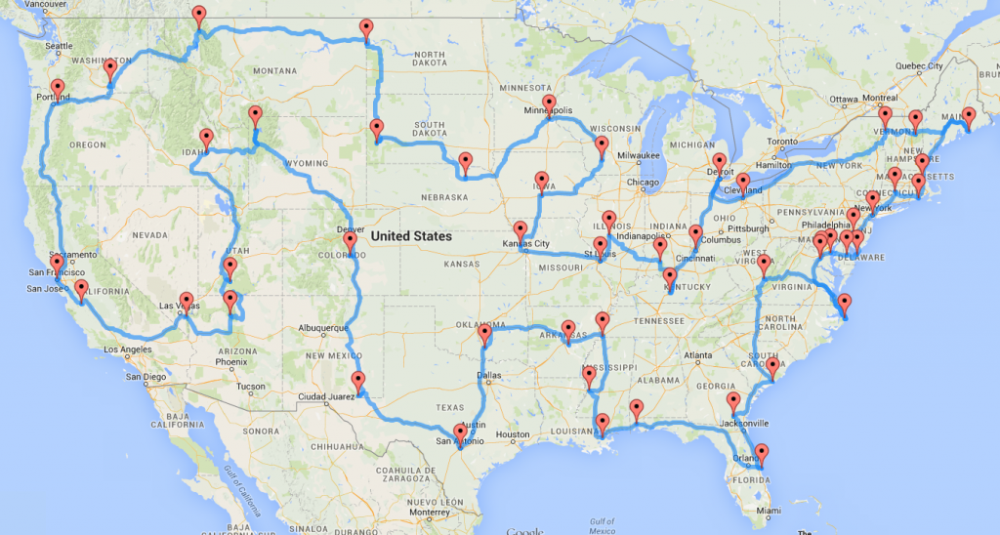

# Занятие 2 - Корректность и эффективность

## Задача коммивояжера



[Постановка](https://ru.wikipedia.org/wiki/%D0%97%D0%B0%D0%B4%D0%B0%D1%87%D0%B0_%D0%BA%D0%BE%D0%BC%D0%BC%D0%B8%D0%B2%D0%BE%D1%8F%D0%B6%D1%91%D1%80%D0%B0)

Параметр задачи — метрика расчета расстояния:

- одномерный случай:

```
(defun dist (p1 p2)
  (abs (- p1 p2)))
```

- двухмерный случай, Эвклидова метрика (точка представлена в виде списка `(list x y)`):

```
(defun dist (p1 p2)
  (sqrt (+ (expt (- (first p1) (first p2)) 2))
           (expt (- (second p1) (second p2)) 2)))))
```

Функция расчета общего расстояния:

```
(defun total-dist (points)
  (let ((rez 0))
    (do ((tail points (rest tail)))
        ((null (rest tail)))
      (incf rez (abs (- (first tail) (second tail)))))
    rez))
```

Функции нахождения маршрута:

- через ближайшего соседа:

```
(defun road-trip (points)
  (let ((rez (list (first points)))
        (point (pop points)))
    (dotimes (i (length points))
      (let ((min most-positive-fixnum)
            (arg nil))
        (dolist (pt points)
          (let ((d (dist pt point)))
            (when (< d min)
              (setf min d)
              (setf arg pt))))
        (push arg rez)
        (setf point arg)
        (setf points (remove point points))))
    (values rez
            (total-dist rez)))
```

- полным перебором

```
(defun road-trip2 (points)
  (let ((min most-positive-fixnum)
        (arg nil))
    (dolist (order (all-permutations points))
      (let ((d (total-dist order)))
        (when (< d min)
          (setf min d)
          (setf arg order))))
    (values arg
            min)))
```

Функция `all-permutations` взята [отсюда](http://stackoverflow.com/questions/2087693/how-can-i-get-all-possible-permutations-of-a-list-with-common-lisp)

Вспомагательные функции для генерации входных данных и отображения на экране (одномерный случай):

```
(defun generate-points (n)
  (let ((rez nil))
    (dotimes (i n)
      (push (random 100) rez))
    rez))

(defun draw-points (points)
  (dotimes (i 100)
    (block find-point
      (dolist (pt points)
        (when (= i pt)
          (princ #\*)
          (return-from find-point)))
      (princ #\-))))

(defun draw-route (points)
  (draw-points points)
  (princ #\Newline)
  (let ((total 0)
        (start (first points)))
    (do ((tail points (rest tail)))
        ((null tail))
      (let* ((p1 (first tail))
             (p2 (or (second tail) start))
             (beg (min p1 p2))
             (end (max p1 p2)))
        (incf total (- end beg))
        (dotimes (i beg)
          (princ #\Space))
        (princ (if (= beg p1) #\> #\<))
        (dotimes (i (- end beg 1))
          (princ #\-))
        (princ (if (= beg p2) #\< #\>))
        (princ #\Newline)))
    total))
```  


## Инструментарий проверки корректности и эффективности алгоритма

Отладка:

- print-отладка
- трассировка
- пошаговая отладка

Профилирование:

- замер общего времени выполнения (в Лиспе функция `time`)
- профилирование: обычное и статистическое


## Сложность алгоритмов


RAM-модель

O() — верхняя оценка сложности выполнения на основе RAM-модели

P — полиномиальные алгоритмы — те, "эффективно" масштабируются на компьютере (т.е. их можно посчитать как для малых объемов входных данных, так и для относительно больших)

NP-полные и NP-трудные алгоритмы — те, которые на современных компьютерах не масштабируются (Пример: задачу коммивояжера для N > 50 точно решить, фактически, нельзя)


## Алгоритм создания алгоритмов от Стивена Скиены

1. Хорошо ли я понимаю задачу?

   a. Каковы входы?

   b. Что ожидается получить на выходе?

   c. Можно ли составить несколько примеров и решить их на листочке? 

   d. Какой тип проблемы мы решаем: вычислительную, геометрическую, на графы, строки, множества? Можно ли ее сформулировать несколькими способами? Какой из способов самый простой?

2. Можно ли найти простой алгоритм решения задачи?

   a. Можно ли решить задачу грубой силой/полным перебором?

   b. Можно ли придумать какую-то эвристику для решения задачи (например, выбирая всегда наибольший элемент)?

   с. Если да, то как понять, что алгоритм всегда дает правильный рещультат?

   d. Как можно измерить/проверить качество моего решения?

   e. Какое время работы этого решения: полиномиальное или экспоненциальное?

3. Есть ли особые случаи этой задачи, которые можно решить?

   a. Можно ли решить задачу эффективно, если проигнорировать какие-то из входных параметров?

   b. Что происходит, если установить какие-то из входов в тривиальные значения (например, 0)?

   c. Можно ли упростить проблему, чтобы решить ее более эффективно?

   d. Если задачу можно решить для более простого случая, то почему это решение нельзя обобщить?

4. Какие стандартные подходы алгоритмического дизайна можно применить?

5. Я все еще застрял? - Повторить сначала, может, что-то изменится... ;)


## To read

- http://bigocheatsheet.com/
- https://habrahabr.ru/post/207112/
- http://stackoverflow.com/questions/1857244/what-are-the-differences-between-np-np-complete-and-np-hard
- https://www.reddit.com/r/dataisbeautiful/comments/2go0o6/the_shortest_path_through_the_48_continental 
- http://flowingdata.com/2016/05/06/algorithms-for-the-traveling-salesman-problem-visualized/
